# Sakhi Saathi (सखी साथी)
**Challenge: The Invisible Woman** · PromptWars × HackArena · SDG 5 (5.1, 5.b), SDG 4 (4.3, 4.4), SDG 10 (10.2)

> A first-time woman user with no English and no tech background can independently find and use essential government services – by **voice or one tap, in her own language**.

**Live demo (Google Cloud Run):** https://sakhi-saathi-567566086238.asia-south1.run.app

## The problem
48% of rural girls in India have never used the internet, and most who have were guided by a male family member. Women are locked out of digital systems by design, not capability.

## What it does
- **Four hand-written languages** – Hindi, Tamil, Telugu, English – plus **seven more** (Bengali, Marathi, Gujarati, Kannada, Malayalam, Punjabi, Odia) translated on demand by **Gemini** and cached on the device.
- **Basic services, no login or profile:** book an LPG cylinder, check a bank balance by missed call, open a Jan Dhan account.
- **Schemes:** Matru Vandana, Ujjwala, Sukanya Samriddhi, Ayushman Bharat, Skill India, widow pension, girls' scholarships, women's savings groups (Lakhpati Didi), Tamil Nadu Magalir Urimai Thogai and monthly-cash schemes for Maharashtra, Karnataka, West Bengal, Madhya Pradesh and Odisha.
- **Optional profile** (state, district, age, category …) that filters "Schemes for you". It lives **only in the phone's localStorage**, is never sent anywhere (not even to Gemini) and can be deleted in one tap.
- **Voice in:** Web Speech API with live transcript and specific, translated error messages. **Talk mode** is on by default wherever the browser can listen (a 🎤 switch in the header turns it off): after the app speaks, it listens, so she can pick her language, answer "yes"/"no", say a choice, her state or district, open her profile, hear the helpline numbers, or say "next", "back", "repeat", "home", "language" or "stop" on any screen. Buttons stay as an optional fallback, and there is no typing anywhere. What she says is used for that screen only and never stored. **Voice out:** on by default; every screen tries to speak as soon as it opens, and because browsers allow sound only after the first tap, that first tap replays what was missed (the first screen also has a glowing "Listen" button that names each language in its own voice). Turning voice off is remembered. Uses a device voice for the language when one exists (an on-device one first, as online voices start later), otherwise **Gemini text-to-speech** from the server (this is what makes Tamil/Telugu work on PCs that have no such voice), fetched a sentence or two at a time so she hears the first words much sooner instead of waiting for the whole text to be made.
- **Official website button** on every service (pmuy.gov.in, pmmvy.wcd.gov.in, scholarships.gov.in, the gas companies' booking sites, state portals …): opens in a new tab with a safety note ("press Back to return; never share your OTP or PIN") and is included in the WhatsApp message.
- **Share on WhatsApp:** one tap sends the checklist (documents, where to go, helplines) in her language, so she can show it at the Anganwadi or send it to a relative.
- **Listen step by step:** reads one short instruction at a time with Next/Back, for slow listeners.
- **Installable and offline-ready (PWA):** "Install app" puts an icon on the home screen; the core app works offline in the four built-in languages.
- **Large-text mode (A+)** for a helper or weak eyesight.
- Every screen: one task, big buttons (≥56 px), illustrated flat icons (no emoji), documents-to-carry list, step-by-step instructions, one-tap call buttons, and no dead ends.

## Architecture
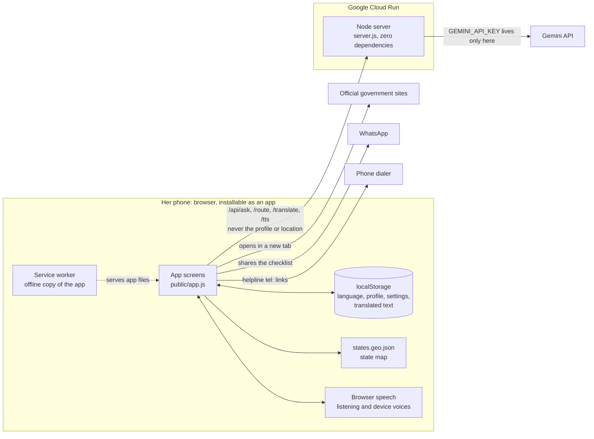

Almost everything runs on the phone: screens, scheme content, eligibility rules, the profile and the state lookup. The server only serves the app and passes requests to Gemini, so the API key never reaches the browser.

### How it works, in pictures
All 19 diagrams, with explanations and the code behind each one, are in [docs/ARCHITECTURE.md](docs/ARCHITECTURE.md).

**Where data lives.** The profile and GPS position never leave the phone; text reaches the server only when an answer needs Gemini, and is not saved.

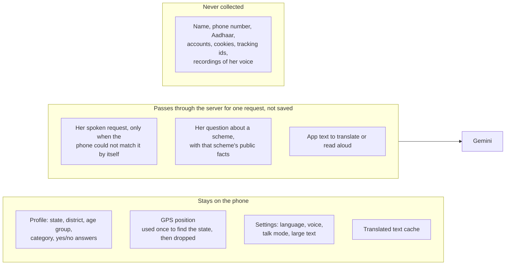

**Screen flow.** One idea per screen, no dead ends; the phone's Back button and the spoken words "home", "back", "language", "repeat" and "stop" work everywhere.

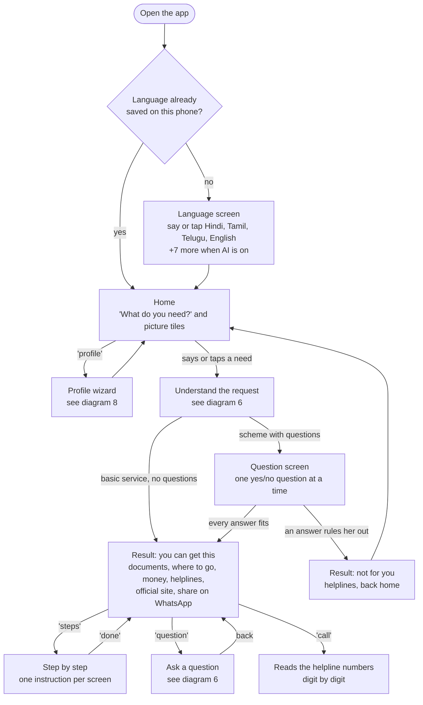

**Talk mode.** Every screen speaks, then listens, retries quietly on silence, and accepts commands before passing her words to the screen.

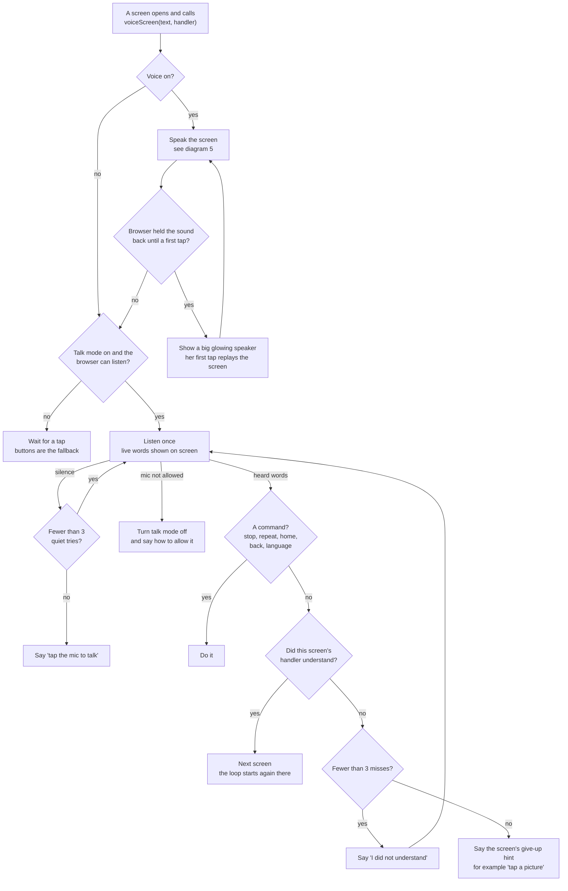

**Understanding a request.** Keyword rules, then name matching, run on the phone; Gemini is asked only when both fail.

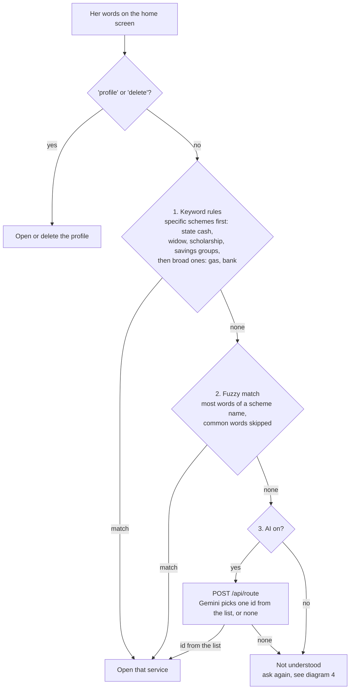

**Eligibility.** Yes/no questions stop at the first answer that rules her out; the home screen shows schemes whose rule passes for her profile, counting skipped questions as "maybe".

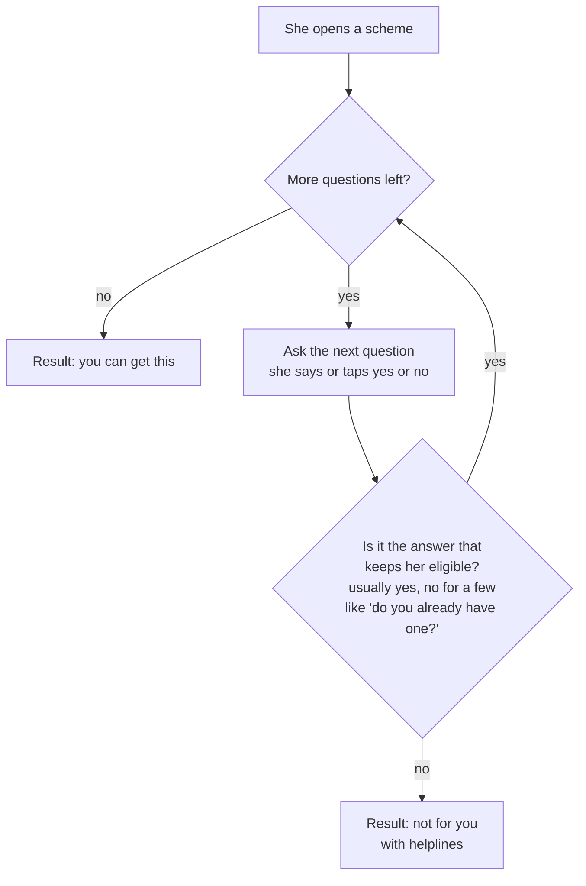

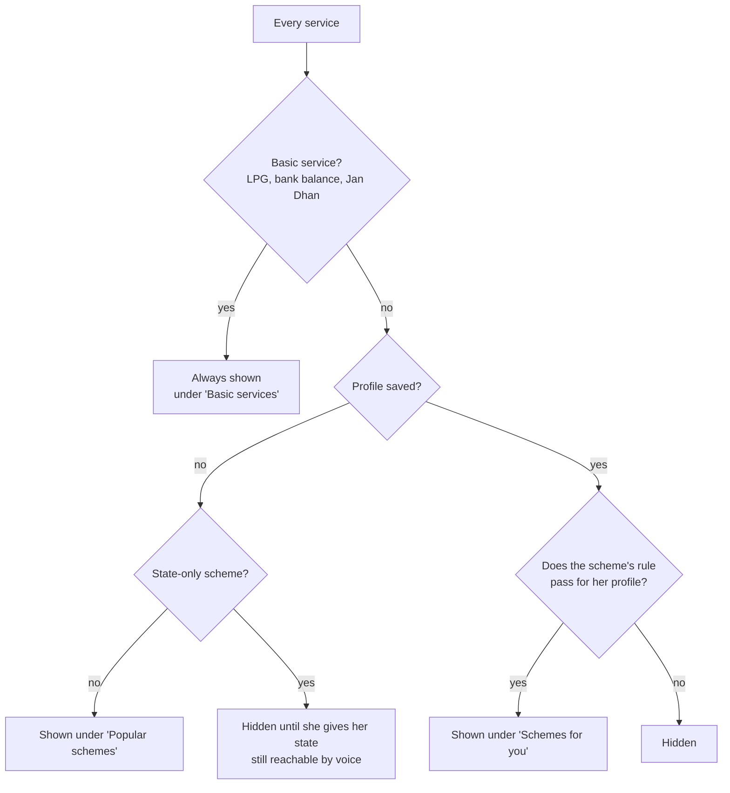

**Find my state.** The phone turns GPS into a state with a bundled map; the coordinates are never sent or stored.

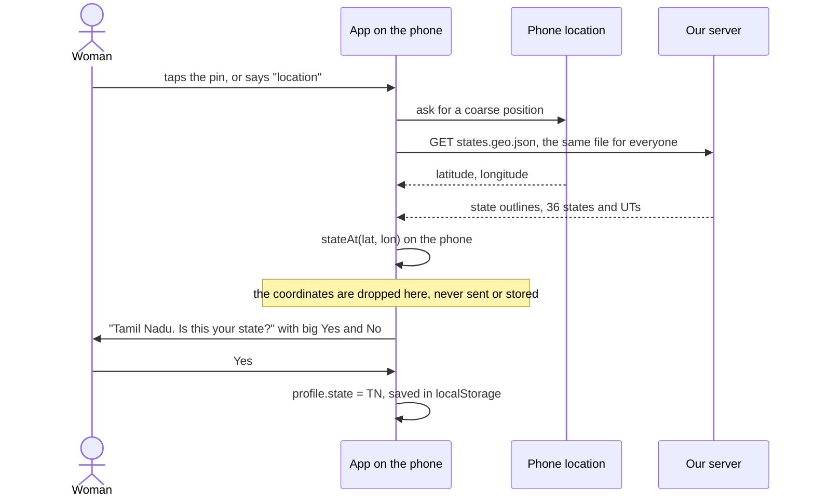

**Server and Gemini.** Cheap checks reject bad requests first; a retired or busy Gemini model is replaced automatically.

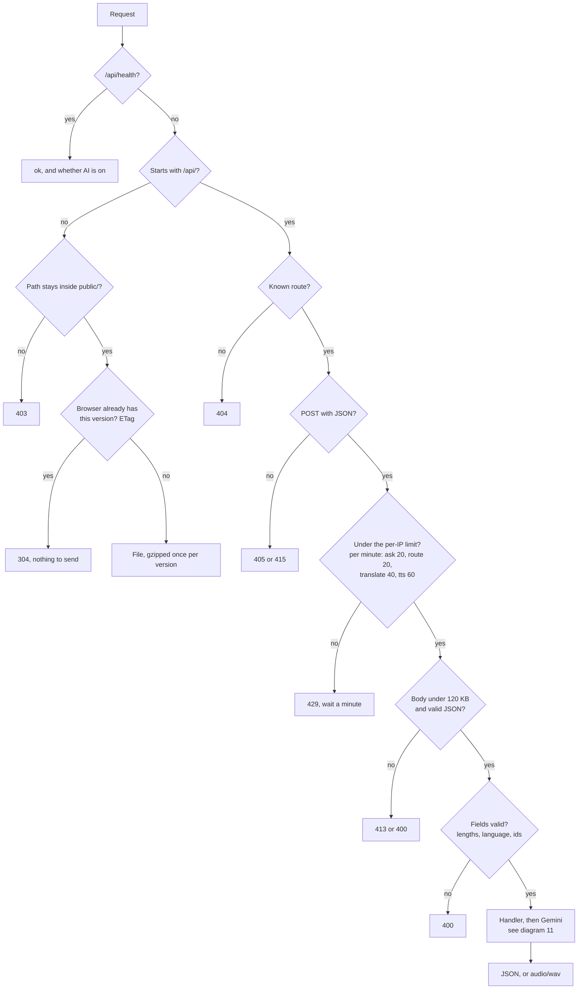

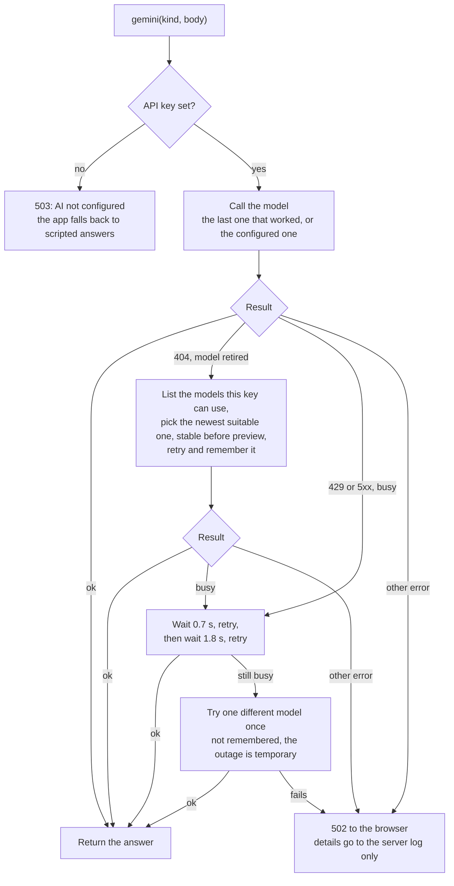

**Data pipeline.** Scheme facts are extracted into tables, validated, and checked for freshness every week.

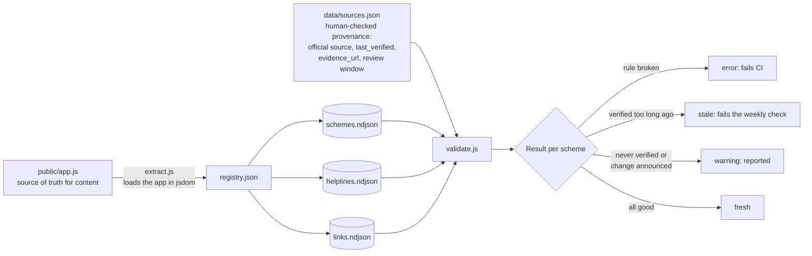

The diagrams are [Mermaid](https://mermaid.js.org/) text that GitHub draws; their sources live in `docs/ARCHITECTURE.md`, and a test checks the README copies stay identical.

### Key properties
- **Google services:** Gemini API (answers, intent routing, translation, text-to-speech) and Google Cloud Run.
- **Security:** key never reaches the browser; CSP forbids inline scripts (`script-src 'self'`); all user text is escaped; request size/length validation; per-IP rate limits; no tracking, no accounts, no personal data stored server-side; non-root container.
- **Efficiency:** no framework, no external fonts or images (inline SVG), small gzip transfer, stateless server.
- **Accessibility:** semantic buttons, `lang` switching, `aria-live` status regions, decorative icons hidden from screen readers, high contrast, large touch targets, reduced-motion support.

## How this maps to the evaluation criteria
| Criterion | Where to look |
|---|---|
| **Problem-statement alignment** | One woman, no English, no tech background, no one to ask: voice-first flow, 4 hand-written languages (+7 via Gemini), picture cards, spoken steps, no typing, no login (`public/app.js`) |
| **Google services** | Gemini API for answers, intent routing, translation and text-to-speech; deployed on Google Cloud Run; secrets in Secret Manager (`server.js`, `Dockerfile`) |
| **Security** | Key only on the server, strict CSP/HSTS headers, input validation, rate limiting, non-root container, on-device profile ([SECURITY.md](SECURITY.md), `test/server.test.js`) |
| **Efficiency** | Zero runtime dependencies, no framework, inline SVG instead of images, ETag revalidation, per-version gzip cache, service-worker offline shell |
| **Testing** | 33 automated tests (`npm test`, `npm run coverage`), CI on every push (`.github/workflows/ci.yml`) |
| **Accessibility** | Skip link, `lang` switching, `aria-live` status regions, labelled controls, hidden decorative icons, 56 px targets, large-text mode, reduced-motion and high-contrast support (`test/app.test.js`) |
| **Code quality** | Small documented server, content-complete data tables enforced by tests, JSDoc on server helpers, `.editorconfig`, MIT licence |

## Run locally
```bash
npm install          # only needed for tests (jsdom)
GEMINI_API_KEY=your_key node server.js     # http://localhost:8080
npm test             # 33 tests: server, security, content completeness, eligibility rules, a11y
```
Without a key everything still works in the four core languages (scripted answers, browser voices); AI answers, extra languages and server voice need `GEMINI_API_KEY`.
To try the AI paths without a key: `node tools/mock-gemini.js` and `GEMINI_BASE=http://localhost:9090 GEMINI_API_KEY=test node server.js`.

## Deploy to Google Cloud Run
```bash
gcloud auth login && gcloud config set project YOUR_PROJECT
gcloud services enable run.googleapis.com cloudbuild.googleapis.com secretmanager.googleapis.com
printf "YOUR_GEMINI_KEY" | gcloud secrets create gemini-api-key --data-file=-
gcloud run deploy sakhi-saathi --source . --region asia-south1 --allow-unauthenticated \
  --set-secrets GEMINI_API_KEY=gemini-api-key:latest
```
(Grant the Cloud Run service account the *Secret Manager Secret Accessor* role if prompted.) Open the printed URL in Chrome or Edge; the microphone needs HTTPS, which Cloud Run provides.

## Project layout
| Path | Purpose |
|---|---|
| `public/` | the app: `index.html`, `app.js` (data, voice, UI), `style.css`, `sw.js` + `manifest.webmanifest` (PWA), icons |
| `server.js` | static hosting + Gemini proxy, validation, rate limiting, security headers |
| `test/` | `server.test.js`, `app.test.js` (`npm test`) |
| `docs/` | `ARCHITECTURE.md` (diagrams of how the app works), `ROADMAP.md` |
| `data/` | scheme data extraction, validation and provenance ([data/README.md](data/README.md)) |
| `tools/` | `mictest.html` (microphone diagnostics), `mock-gemini.js`, `make-icons.js` |
| `Dockerfile` | Cloud Run image |
| `VIBE_PROMPT.md` | the prompt used to vibe-code the app |

## Adding a service or language
- **Service:** add one object to `S` in `public/app.js` (name, description, questions, documents, where, info, helplines, facts) and, if needed, an eligibility rule in `FIT`. Tests fail if any core language is missing.
- **Language:** hand-write a block in `U`/`PU` and a column per text, or add it to `EXTRA` to have Gemini translate it.

## Honest limits
Scheme amounts, helpline numbers and eligibility rules were compiled from public guidelines and **must be confirmed locally** (the app says so). District is stored for display only; district-level offices are not bundled. Extra-language translations are machine-generated and should be reviewed by a native speaker before wide use.

## Model names
Defaults: text `gemini-3.1-flash-lite`, voice `gemini-3.8-flash-preview-tts` (override with `GEMINI_MODEL` / `GEMINI_TTS_MODEL`). If Google retires a model (HTTP 404) the server lists the models available to the key, switches to the newest suitable one, remembers it and retries – so a model rename does not take the app down. Details are written to the server log only.
