# Architecture

Pictures of how Sakhi Saathi works, drawn from the code on `main`. Every diagram is [Mermaid](https://mermaid.js.org/):
GitHub draws it on this page, and it stays plain text, so it can be edited in the same pull request as the code it describes.
Each one has a short explanation and the functions to read next.

| # | Diagram | What it answers |
|---|---|---|
| 1 | [The big picture](#1-the-big-picture) | What runs where |
| 2 | [Where data lives](#2-where-data-lives-privacy-map) | What stays on the phone, what reaches the server, what is never collected |
| 3 | [Screen flow](#3-screen-flow) | The path a woman takes through the app |
| 4 | [Talk mode loop](#4-talk-mode-the-voice-loop-on-every-screen) | How every screen speaks, listens and reacts |
| 5 | [Voice out](#5-voice-out-choosing-a-voice) | Which voice reads the text, and how it starts fast |
| 6 | [Understanding a request](#6-understanding-what-she-asks-for) | How "I need gas" becomes the LPG screen |
| 7 | [Eligibility](#7-eligibility-logic) | Yes/no questions, and which schemes the home screen shows |
| 8 | [Profile and Find my state](#8-profile-wizard-and-find-my-state) | The optional profile, and GPS to state on the phone |
| 9 | [More languages](#9-more-languages-translation-on-demand) | How 7 extra languages are translated once and cached |
| 10 | [Server pipeline](#10-server-request-pipeline) | The checks every request passes |
| 11 | [Gemini resilience](#11-gemini-resilience) | Retries and model fallback |
| 12 | [Data pipeline](#12-data-pipeline-scheme-facts-as-a-data-product) | Scheme facts as tables, validation, freshness |
| 13 | [Build and deploy](#13-build-test-and-deploy) | CI, the weekly data check, Cloud Run |
| 14 | [Offline](#14-offline-the-service-worker) | The service worker cache |
| 15 | [Target (roadmap)](#15-target-roadmap) | The analytics platform still to be built |

---

## 1. The big picture

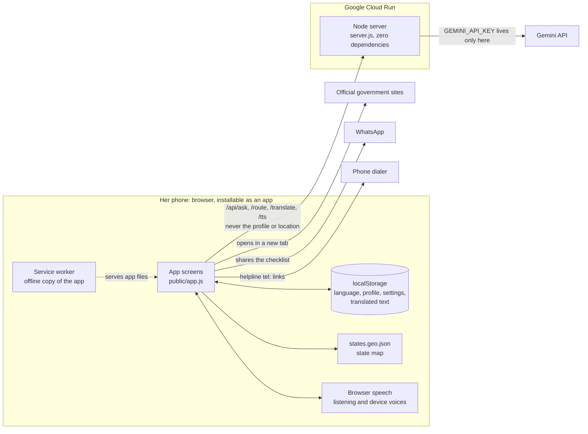

Almost everything happens on the phone: the screens, the scheme content, the eligibility rules, the profile and the
state lookup. The server has two jobs: serve the app's files, and act as a small proxy to Gemini so the API key never
reaches the browser. Without a key the app still works in Hindi, Tamil, Telugu and English with scripted answers and
device voices; the AI only adds extra languages, free-form answers, smarter matching and a voice for languages the
phone has none for.

**Code:** `public/app.js` (all screens and content), `server.js` (static files + `/api/*`), `public/sw.js` (offline).

---

## 2. Where data lives (privacy map)

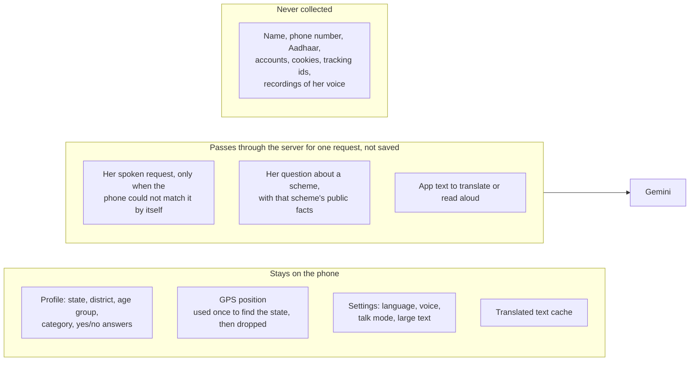

The product promise is "no personal data", so this map is the one to check before any change. The profile and the
GPS position never leave the phone (`saveProfile`, `locateState`). Listening is done by the browser's own speech
service, which hands the app only text; the app uses that text for the current screen and drops it. Text reaches
our server only when it is needed for an answer, and the server keeps it only in small in-memory caches (translations,
the last 40 audio clips) that disappear on restart. The client's IP address is held in memory for rate limiting and
is never written to logs; the server logs only Gemini errors and model switches.

---

## 3. Screen flow

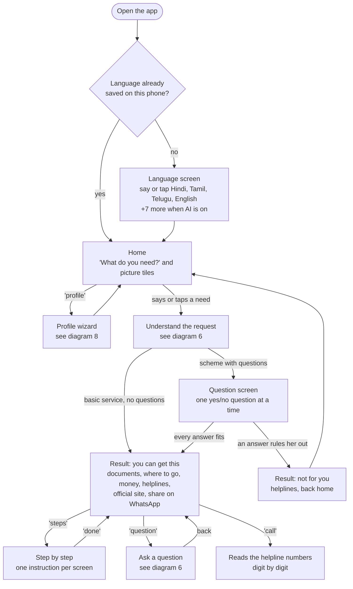

One idea per screen, and no dead ends. Every screen is a browser history entry (`screen()`), so the phone's Back
button goes one screen back instead of closing the app. On any screen she can also say "home", "back", "language",
"repeat" or "stop". A returning user skips the language screen.

**Code:** `langScreen`, `home`, `open`, `flow`, `result`, `stepScreen`, `askScreen`, `screen` and the `popstate` handler in `public/app.js`.

---

## 4. Talk mode: the voice loop on every screen

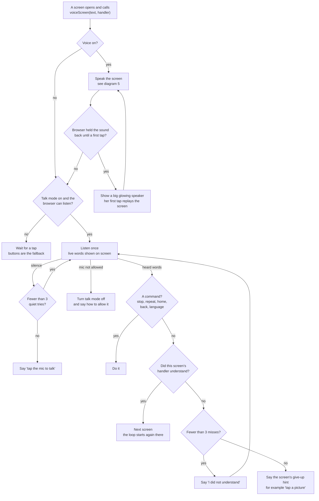

Every screen is built the same way: it renders its buttons, then hands `voiceScreen` the words to say and a handler
for her answer. The handler returns `false` when it did not understand, which drives the retry counter. On screens
that expect free speech (her need, her district, a question) a command only counts if it is three words or fewer, so
"I want to go back to my village" is not taken as "back". Browsers allow sound and the microphone only after one tap,
which is why the glowing speaker exists.

**Code:** `voiceScreen`, `speakThenHear`, `tapHint`, `hear`, `listen`, `command`, `act` in `public/app.js`.

---

## 5. Voice out: choosing a voice

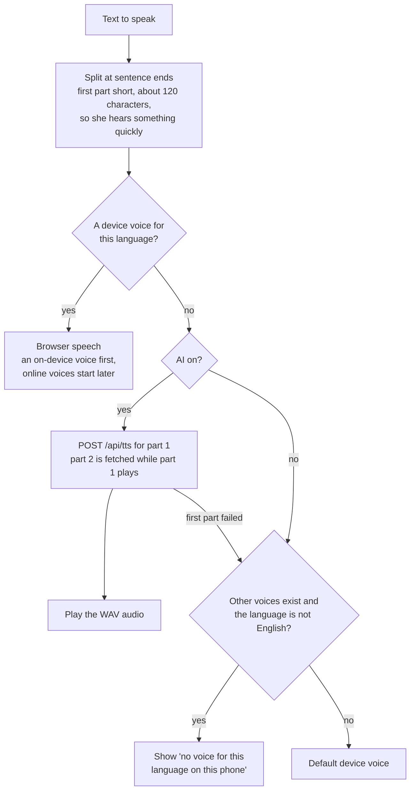

Many PCs have no Tamil or Telugu voice, so the server's Gemini voice fills the gap. Fetching one sentence group at a
time means she waits for the first sentence, not the whole paragraph, and `warm()` fetches the next question's audio
while she is still answering the current one. A new screen always cancels what the old one was saying (`speechToken`),
so two screens never talk over each other.

**Code:** `say`, `speakOne`, `chunks`, `voiceFor`, `speakLocal`, `ttsUrl`, `warm` in `public/app.js`; `apiTts`, `pcmToWav` in `server.js`.

---

## 6. Understanding what she asks for

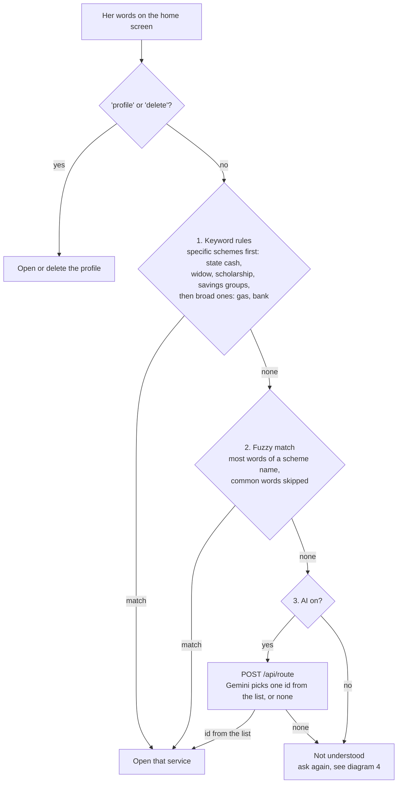

The cheap, offline rules run first, so most requests never leave the phone; only words the rules cannot place are
sent to Gemini. Specific schemes are tried before broad ones because "my daughter's bank account" should open Sukanya
Samriddhi, not the bank-balance service. The server only accepts an id that is in the list it was given, so the model
cannot invent a service.

**Asking a question about a scheme** works the same way: with AI on, `/api/ask` answers in at most three short
sentences using only that scheme's facts; without AI (or if the call fails) the phone answers from the scheme's own
documents, "where to go" or money text, picked by keywords, or gives the helpline number.

**Code:** `route`, `fuzzyScheme`, `respond` in `public/app.js`; `apiRoute`, `apiAsk` in `server.js`.

---

## 7. Eligibility logic

**Inside a scheme:** yes/no questions, stopping at the first answer that rules her out.

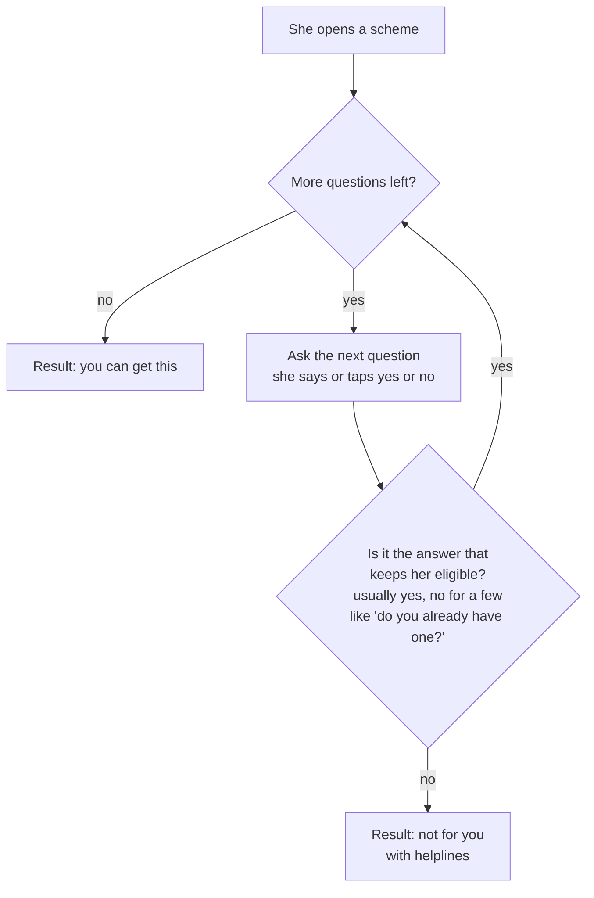

**On the home screen:** which scheme tiles she sees.

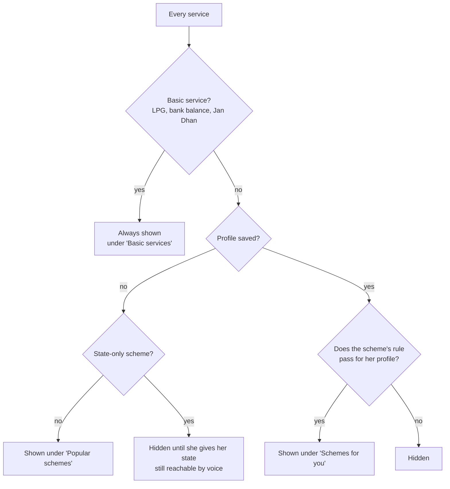

Each scheme has one small rule in `FIT`, for example *Matru Vandana: pregnant or a new mother, aged 18 to 59* or *a state cash scheme: same state, and her age group overlaps the scheme's age range*. A
skipped question counts as "maybe" (rules test `!== 'no'`), and a rule that errors counts as a pass, so the app would
rather show one scheme too many than hide one she could get. The questions inside a scheme still decide.

**Code:** `flow` (uses each scheme's `qs` and `qNo`), `home`, `FIT`, `fit`, `ageR` in `public/app.js`; tested in `test/app.test.js`.

---

## 8. Profile wizard and Find my state

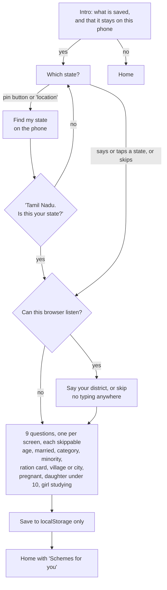

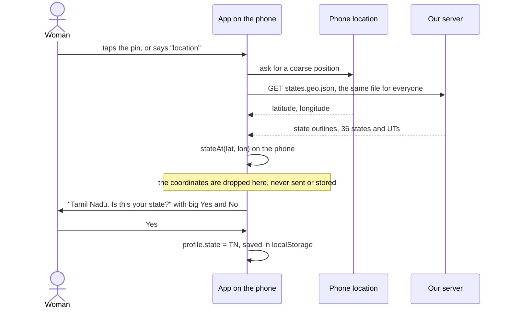

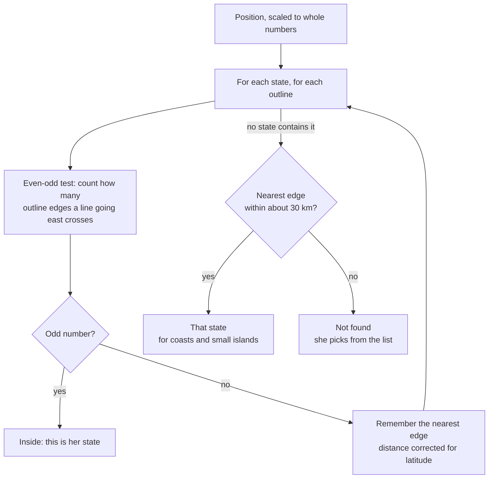

Answers are spoken, not typed: a spoken number becomes an age group and "village"/"गाँव"/"கிராமம்" becomes `rural`
(`pickOption`). The state map ships with the app, so finding the state needs no reverse-geocoding API and nobody
learns where she is. A wrong guess near a border costs one "no". The map itself is built by a batch job (diagram 12).

**Code:** `profFlow`, `profScreen`, `locConfirm`, `profSave`, `locateState`, `stateAt`, `pickOption` in `public/app.js`; `test/geo.test.js`.

---

## 9. More languages: translation on demand

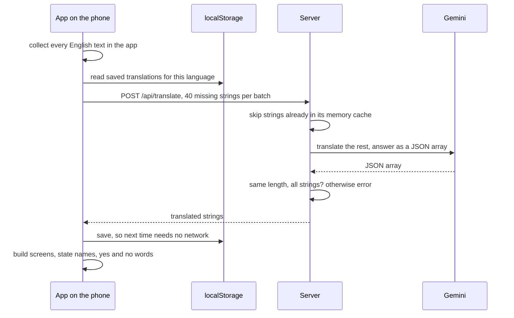

Hindi, Tamil, Telugu and English are written by hand. Bengali, Marathi, Gujarati, Kannada, Malayalam, Punjabi and
Odia are translated once per phone, cached in two places (the server's memory for everyone, the phone's localStorage
for her), and checked for shape before use. A cached language opens instantly and works offline.

**Code:** `collectTranslatable`, `ensureLang`, `applyTranslation`, `chooseLang` in `public/app.js`; `apiTranslate` in `server.js`.

---

## 10. Server request pipeline

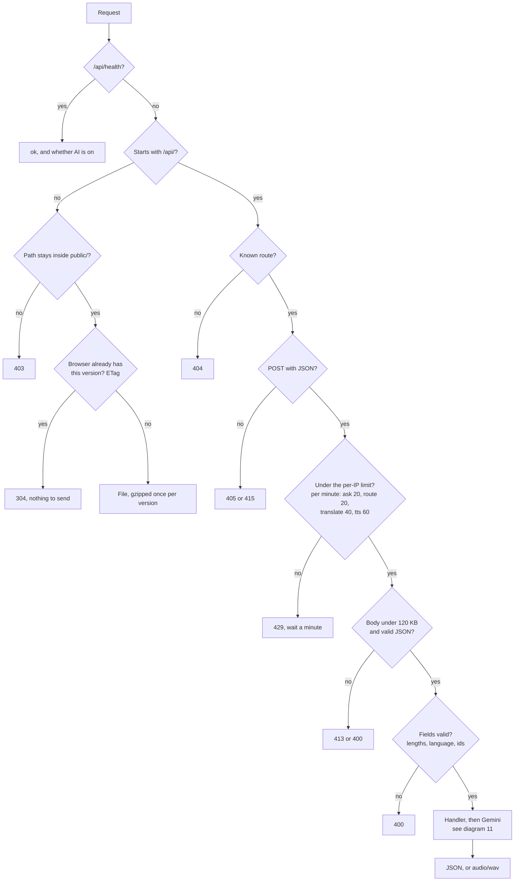

Every response carries strict security headers (a Content-Security-Policy that blocks inline scripts, HSTS,
no-referrer, microphone and location allowed only for this site). Cheap checks come first, so a bad or abusive request
is rejected before it can cost a Gemini call. The server keeps no state that matters: Cloud Run can start or stop
copies of it at any time.

**Code:** `handler`, `handleApi`, `serveStatic`, `allow`, `validateAsk`/`Route`/`Translate`/`Tts`, `SECURITY_HEADERS` in `server.js`; `test/server.test.js`.

---

## 11. Gemini resilience

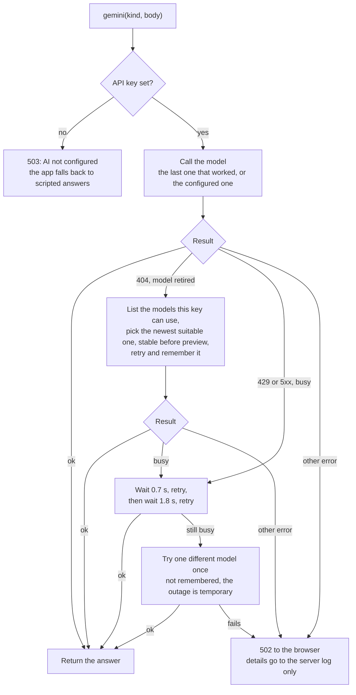

Google renames and retires Gemini models often. Instead of failing when that happens, the server finds a working model
by itself and keeps using it, so the live demo does not break on a model rename. On the phone every AI feature has a
non-AI fallback, so a 502 means a simpler answer, not an error screen.

**Code:** `gemini`, `callModel`, `discoverModel` in `server.js`; `tools/mock-gemini.js` to try it without a real key.

---

## 12. Data pipeline: scheme facts as a data product

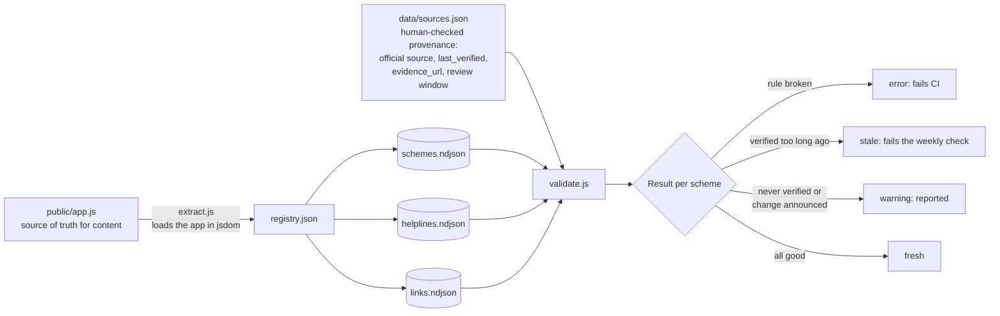

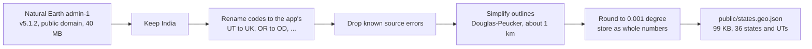

Scheme amounts and rules go out of date, so the content is treated like a dataset: extracted into flat tables in
BigQuery's load format (NDJSON), checked against rules, and given a freshness status from human-verified provenance.
Extraction runs the real app in jsdom, so the tables can never drift from what users see. Errors (a missing language, a
non-government link, a bad phone number, a scheme with no source) fail CI; a verification older than its review window
(60 days for state cash schemes, 180 for central ones) fails the weekly check. The state map is a second, smaller
batch job whose output ships with the app.

**Code:** `data/extract.js`, `data/validate.js`, `data/geo.js`, `data/sources.json`; `test/data.test.js`, `test/geo.test.js`. Details in [`data/README.md`](../data/README.md).

---

## 13. Build, test and deploy

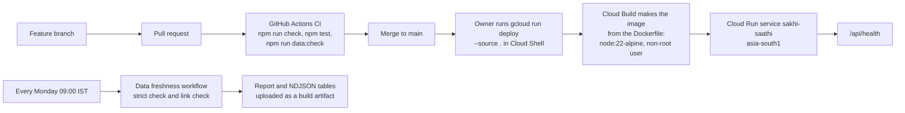

`main` is always deployable. Deploys are manual on purpose: the Cloud Run project belongs to a separate Google account,
and the Gemini key setting carries over from the previous revision. The image holds only `package.json`, `server.js`
and `public/`; it has no runtime dependencies to install.

**Code:** `.github/workflows/ci.yml`, `.github/workflows/data-freshness.yml`, `Dockerfile`; deploy steps in [`CLAUDE.md`](../CLAUDE.md).

---

## 14. Offline: the service worker

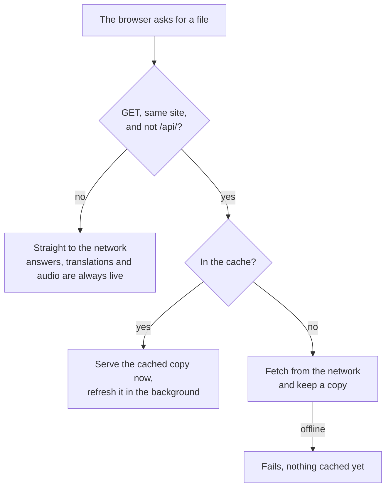

The app opens instantly and works without signal in the four built-in languages. The cost of "cached copy first" is
that a fresh deploy appears on the second page load, not the first.

**Code:** `public/sw.js`.

---

## 15. Target (roadmap)

What is planned to turn this into a full data platform (see [`ROADMAP.md`](ROADMAP.md)). None of this is built yet.

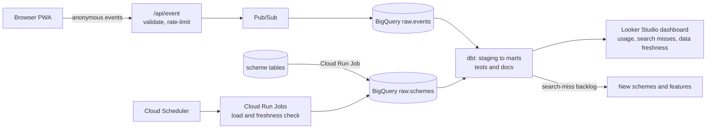

## Design decisions
- **Privacy first.** The product promise is "no personal data". Events carry only coarse, non-identifying fields (event type, scheme id, language, optional state the user picked, app version, day). No IP, no cookie or persistent id, no free text, no voice. Dashboards hide groups smaller than a threshold.
- **Location stays on the phone.** "Find my state" turns GPS into a state with a bundled public-domain map (`public/states.geo.json`, built by `data/geo.js`), so no coordinates reach the server or a geocoding API.
- **Rules before AI.** Matching, eligibility and fallbacks run on the phone; Gemini is called only for what rules cannot do, which keeps cost, latency and data sent to a minimum, and keeps the app useful without a key.
- **The app stays the source of truth for content**; the pipeline reads it exactly as the browser does, so data and product cannot drift.
- **Freshness is a first-class metric.** Scheme facts expire; each has a provenance entry and a review window, and the weekly job fails when one goes stale.
- **Cost control.** BigQuery free tier is enough for this volume; tables are partitioned by day and clustered by event type, and dashboards query marts, not raw tables.
