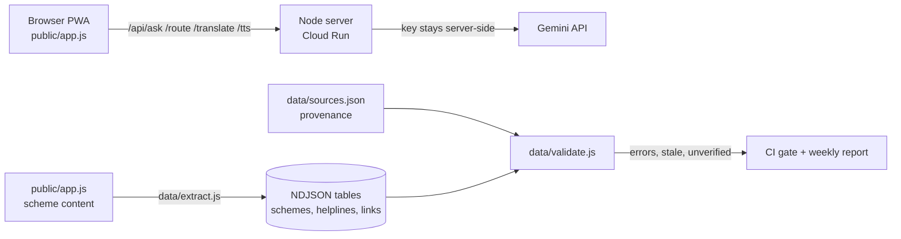
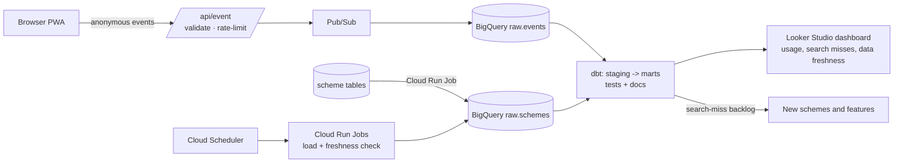

# Architecture

## Today (shipped)

## Target (roadmap)

## Design decisions
- **Privacy first.** The product promise is "no personal data". Events carry only coarse, non-identifying fields (event type, scheme id, language, optional state the user picked, app version, day). No IP, no cookie or persistent id, no free text, no voice. Dashboards hide groups smaller than a threshold.
- **The app stays the source of truth for content**; the pipeline reads it exactly as the browser does, so data and product cannot drift.
- **Freshness is a first-class metric.** Scheme facts expire; each has a provenance entry and a review window, and the weekly job fails when one goes stale.
- **Cost control.** BigQuery free tier is enough for this volume; tables are partitioned by day and clustered by event type, and dashboards query marts, not raw tables.
